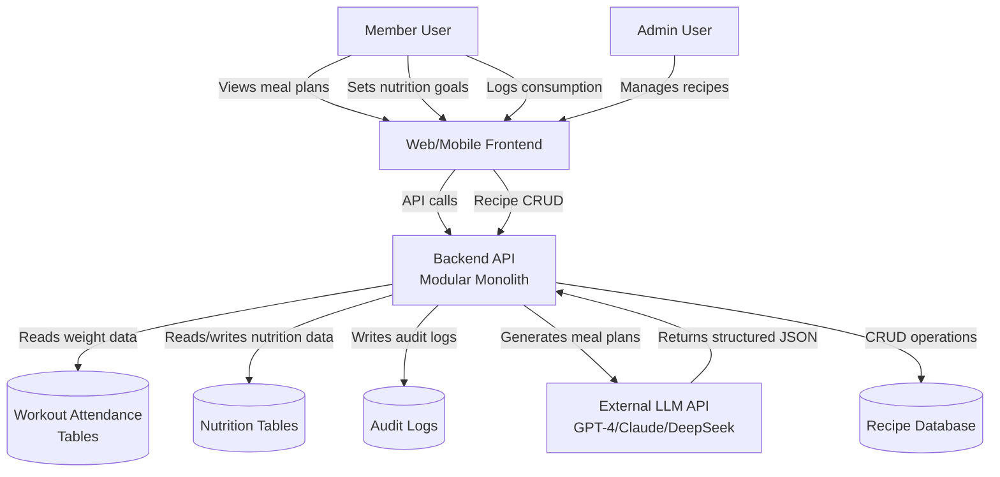
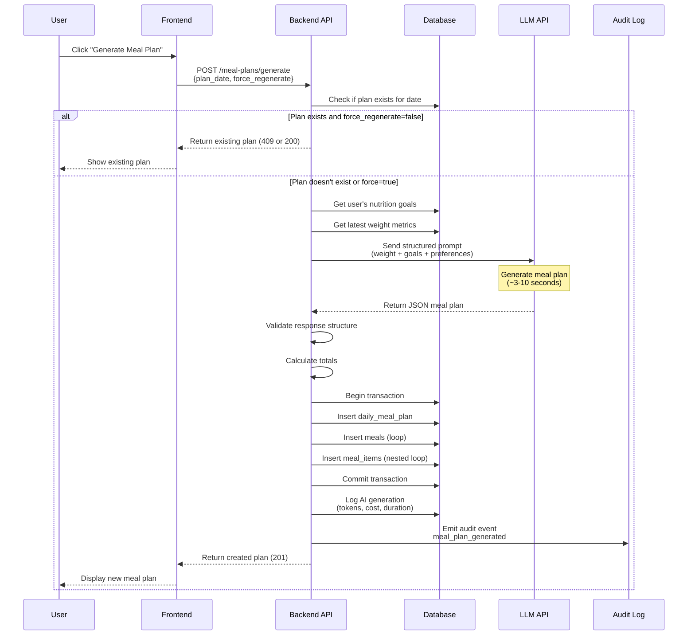
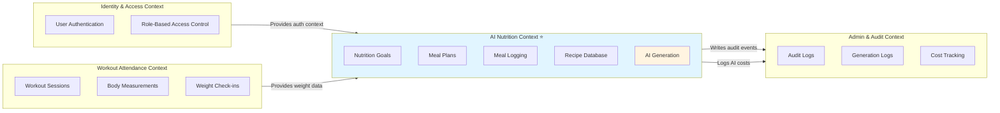
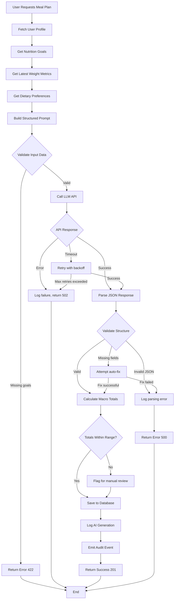
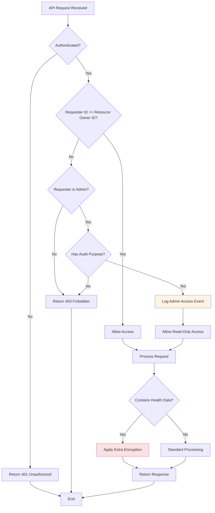
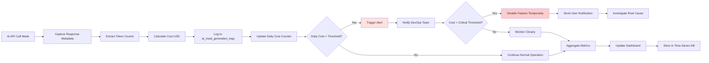
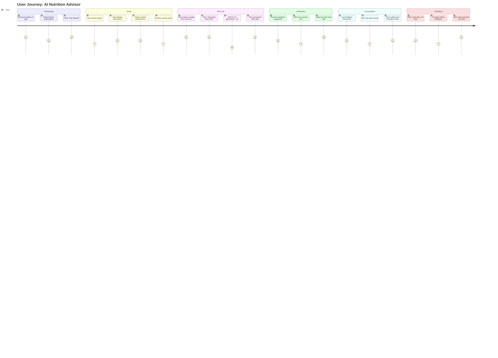
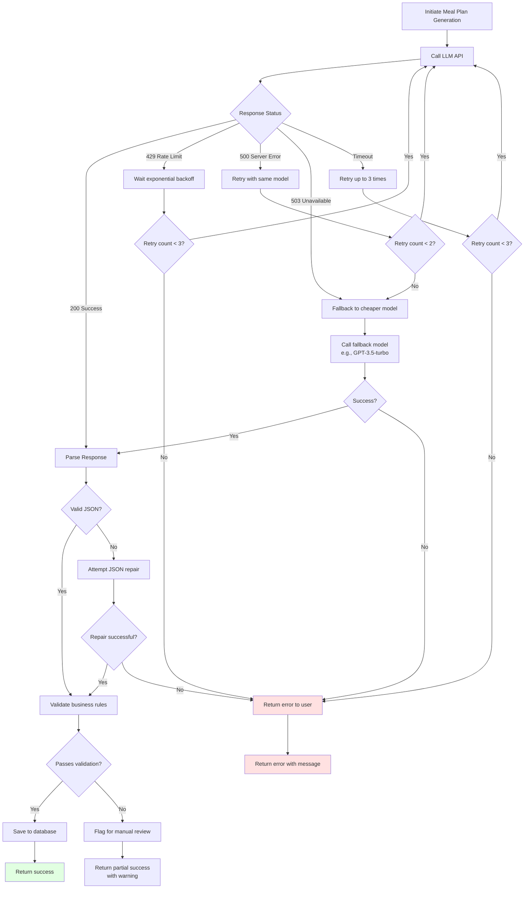
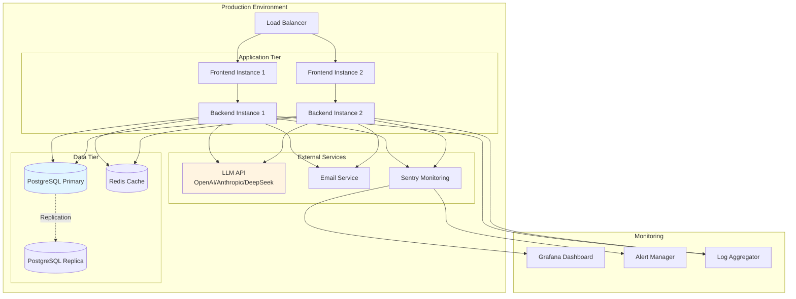

# AI Nutrition Feature - Data Flow & Architecture Diagrams

## 1. System Context Diagram



---

## 2. Meal Plan Generation Flow



---

## 3. Database Entity Relationship Diagram

```mermaid
erDiagram
    USERS ||--o| MEMBER_NUTRITION_GOALS : has
    USERS ||--o{ DAILY_MEAL_PLANS : creates
    USERS ||--o{ MEAL_CONSUMPTION_LOGS : logs
    USERS ||--o{ AI_MEAL_GENERATION_LOGS : triggers
    
    DAILY_MEAL_PLANS ||--|{ MEALS : contains
    MEALS ||--|{ MEAL_ITEMS : includes
    MEALS }o--|| RECIPES : "based on (optional)"
    
    RECIPES ||--|{ RECIPE_INGREDIENTS : has
    
    WORKOUT_SESSIONS ||--o{ BODY_MEASUREMENTS : records
    BODY_MEASUREMENTS ||--|| USERS : belongs to
    
    USERS {
        text id PK
        text email UK
        timestamptz created_at
    }
    
    MEMBER_NUTRITION_GOALS {
        text id PK
        text user_id FK
        integer daily_calories_target
        numeric protein_grams_target
        numeric carbs_grams_target
        numeric fat_grams_target
        jsonb dietary_restrictions
        jsonb allergies
        jsonb preferences
        text goal_type
        text activity_level
    }
    
    DAILY_MEAL_PLANS {
        text id PK
        text user_id FK
        date plan_date
        integer total_calories
        numeric total_protein
        numeric total_carbs
        numeric total_fat
        boolean generated_by_ai
        text ai_model_version
        text status
        integer user_feedback_score
    }
    
    MEALS {
        text id PK
        text daily_meal_plan_id FK
        text meal_type
        text meal_name
        integer calories
        numeric protein
        numeric carbs
        numeric fat
        text source
    }
    
    MEAL_ITEMS {
        text id PK
        text meal_id FK
        text item_name
        numeric quantity
        text unit
        numeric calories
        numeric protein
        numeric carbs
        numeric fat
    }
    
    RECIPES {
        text id PK
        text name
        text category
        text cuisine_type
        jsonb dietary_tags
        boolean is_active
    }
    
    MEAL_CONSUMPTION_LOGS {
        text id PK
        text user_id FK
        text meal_id FK
        timestamptz consumed_at
        numeric actual_calories
        numeric portion_multiplier
    }
    
    AI_MEAL_GENERATION_LOGS {
        text id PK
        text user_id FK
        date request_date
        text ai_model
        integer prompt_tokens
        integer completion_tokens
        numeric total_cost_usd
        boolean success
        text error_message
    }
```

---

## 4. Context Boundary Diagram (DDD)



---

## 5. AI Prompt Engineering Flow



---

## 6. Security & Privacy Flow



---

## 7. Cost Tracking & Monitoring Flow



---

## 8. User Journey: First-Time Nutrition Feature Use



---

## 9. Error Handling & Retry Strategy



---

## 10. Deployment Architecture



---

## Key Insights from Diagrams

### 1. **Data Flow Complexity**
- Simple read from workout attendance → complex AI processing → multiple writes
- Transaction boundaries clearly defined (meal plan + meals + items in one transaction)
- Audit logging happens after successful commit (don't block user experience)

### 2. **Security Boundaries**
- Strict ownership model (user can only access own data)
- Admin access requires explicit audit purpose and is logged
- Health data receives extra encryption layer

### 3. **Cost Management**
- Real-time cost tracking per API call
- Automatic alerts at thresholds
- Fallback strategy to cheaper models if primary fails or budget exceeded

### 4. **Error Resilience**
- Multiple retry strategies (exponential backoff, model fallback)
- Graceful degradation (show cached plan if generation fails)
- Clear error messages to users (avoid technical jargon)

### 5. **User Experience**
- Onboarding flow guides users through setup
- Generation time ~5 seconds (manage expectations with loading state)
- Immediate feedback loop (rate plans to improve future recommendations)

---

**Diagram Version**: 1.0  
**Created**: 2026-04-24  
**Tools Used**: Mermaid.js for all diagrams  
**Recommended Viewer**: GitHub, GitLab, or any Mermaid-compatible markdown viewer
